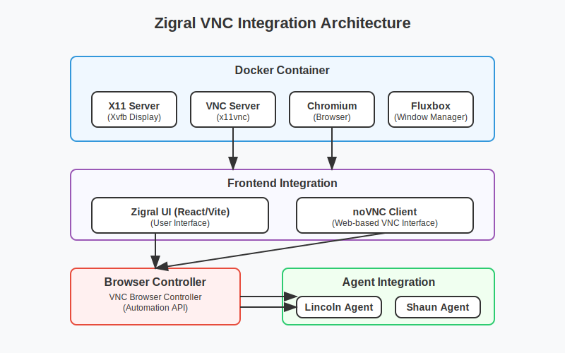

# Zigral VNC Integration

This project integrates noVNC-based browser automation into the Zigral platform, allowing Lincoln and Shaun agents to automate tasks using a containerized browser environment.

## Overview

The Zigral VNC integration provides:

1. A containerized environment with X11, VNC, Chromium, and a window manager
2. A web-based VNC client (noVNC) integrated into the Zigral frontend
3. Browser controllers for agents to interact with the VNC-based browser
4. Demo scripts to test the functionality

## Architecture



- **Docker Container**: Hosts the VNC server, Chromium browser, and X11 environment
- **Frontend Integration**: Uses noVNC to connect to the VNC server
- **Browser Controller**: A Python library that allows agents to control the VNC-based browser
- **Agent Integration**: Lincoln and Shaun agents can use the browser controller to automate tasks

## Prerequisites

- Docker
- Python 3.8+
- Node.js 14+ (for frontend development)
- Playwright

## Setup

### 1. Build the Docker Image

```bash
cd zigral-vnc
docker build -f Dockerfile.vm.fixed4 -t zigral-vnc-agent-vm-chromium .
```

### 2. Install Dependencies

```bash
# Install Python dependencies
pip install -r requirements.txt

# Install noVNC (if not already included)
mkdir -p src/ui/public/novnc
cd src/ui/public/novnc
curl -L https://github.com/novnc/noVNC/archive/v1.3.0.tar.gz | tar -xz --strip-components=1
```

## Running the Demo

The easiest way to test the integration is to use the provided demo script:

```bash
cd zigral-vnc
./demo.sh
```

This script will:
1. Start the Docker container with VNC and Chromium
2. Start the frontend server with noVNC integration
3. Run the demo scripts to showcase the functionality

## Manual Usage

### 1. Start the VNC Container

```bash
docker run --rm -d -p 5900:5900 -p 6080:6080 -p 6081:6081 -p 9222:9222 --name zigral-vnc-chromium zigral-vnc-agent-vm-chromium
```

### 2. Start the Frontend Server

```bash
cd zigral-vnc
./start_frontend.sh
```

### 3. Access the VNC Interface

- Web interface: http://localhost:8090
- Direct VNC connection: localhost:5900 (password: zigral)

## Usage in Agent Code

### Lincoln Agent (LinkedIn Automation)

```python
from src.agents.lincoln import LincolnAgent

# Initialize the agent with VNC mode
agent = LincolnAgent(use_vnc=True)
await agent.initialize()

# Log in to LinkedIn
await agent.login(credentials)

# Perform LinkedIn operations
await agent.search_people("CTOs in San Francisco")
```

### Shaun Agent (Google Sheets Automation)

```python
from src.agents.shaun.agent import ShaunAgent, GoogleCredentials

# Initialize the agent with VNC mode
agent = ShaunAgent(use_vnc=True)
await agent.initialize()

# Log in to Google
credentials = GoogleCredentials(
    email="your-email@gmail.com",
    password="your-password"
)
await agent.login(credentials)

# Open a spreadsheet
await agent.open_spreadsheet("spreadsheet-id")
```

## Development

### Extending the Browser Controller

The VNC browser controller (`src/agents/vnc/browser_controller.py`) can be extended with additional methods for more complex interactions:

```python
# Example extension to support drag-and-drop
async def drag_and_drop(self, start_x, start_y, end_x, end_y):
    """Perform drag and drop operation."""
    # Implementation details...
```

### Adding Visual Recognition

For more advanced automation, visual recognition can be added:

```python
# Example of using computer vision to find elements
async def find_element_by_image(self, template_path):
    """Find an element on screen matching the template image."""
    # Implementation using OpenCV or similar...
```

## Troubleshooting

### VNC Connection Issues

If you cannot connect to the VNC server:

1. Ensure the container is running: `docker ps | grep zigral-vnc`
2. Check the container logs: `docker logs zigral-vnc-chromium`
3. Verify the ports are not in use: `netstat -tuln | grep 5900`

### Browser Automation Issues

If the browser automation is not working:

1. Check the logs: `tail -f zigral-vnc/demo.log`
2. Try connecting manually with a VNC client to verify the display works
3. Check for JavaScript errors in the browser console

## License

MIT License